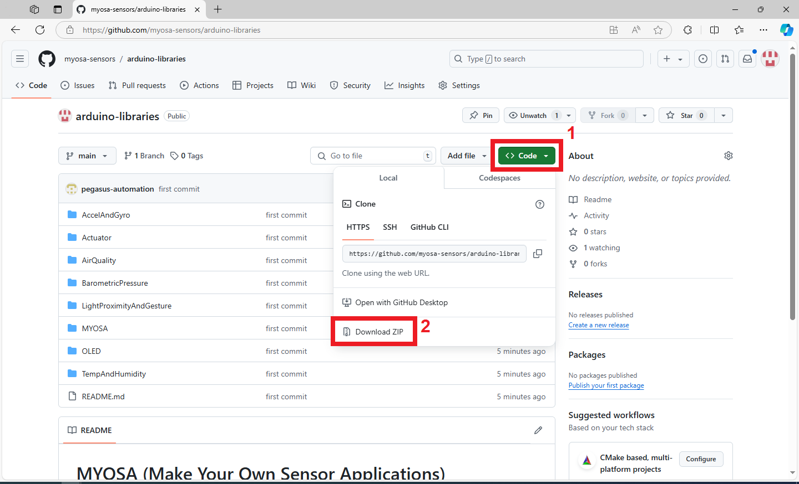

# Adding MYOSA Libraries into Arduino IDE

1. Go to the [MYOSA Libraries GitHub page](https://github.com/pegasus-automation/myosa). Click on **Code** and then click on **Download ZIP**.

   

2. Extract the ZIP file. This will give you a folder named `myosa-main`, and inside it, you will find other folders as shown below.

   

3. Select all the folders inside the `myosa-main` folder, copy them, and paste them into your `Documents -> Arduino -> libraries` folder.

   

4. If the Arduino IDE is already open, close and reopen it. You will find the MYOSA examples in **File -> Examples -> MYOSA**.

   

