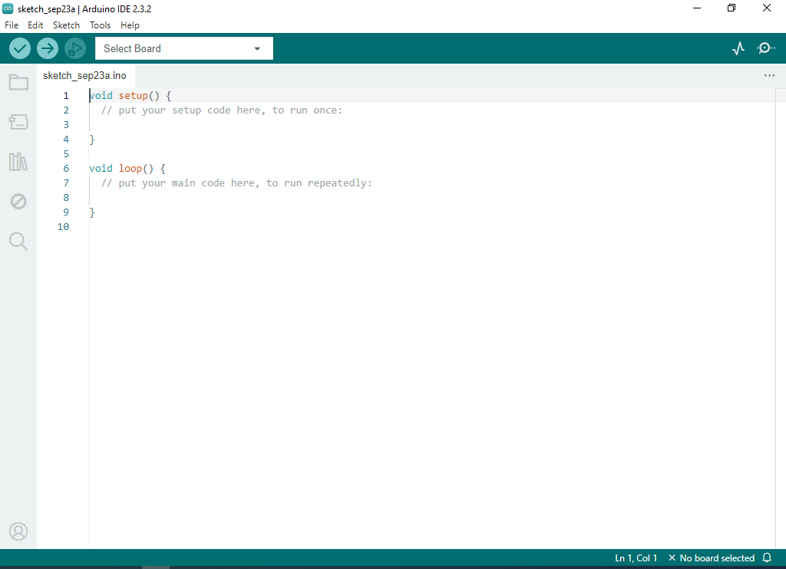
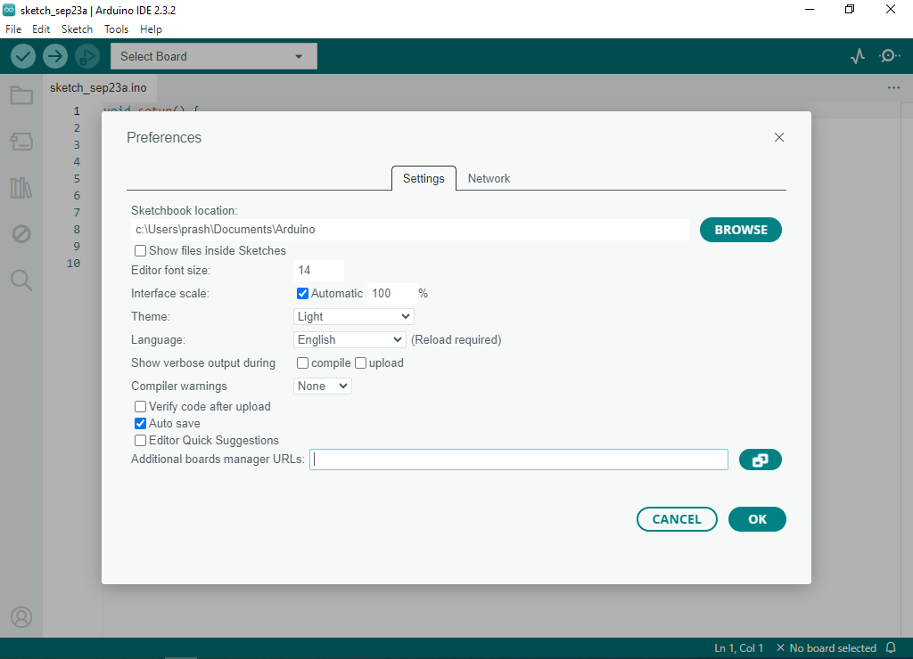
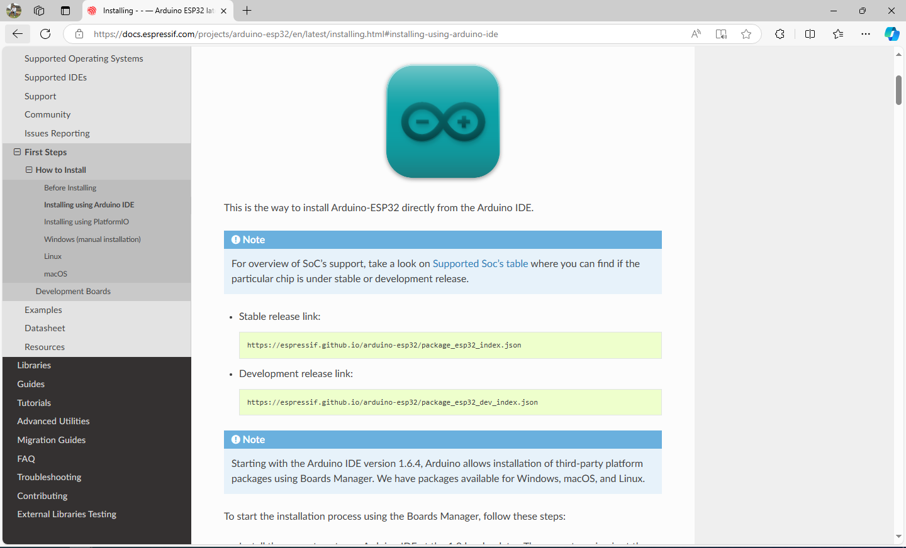
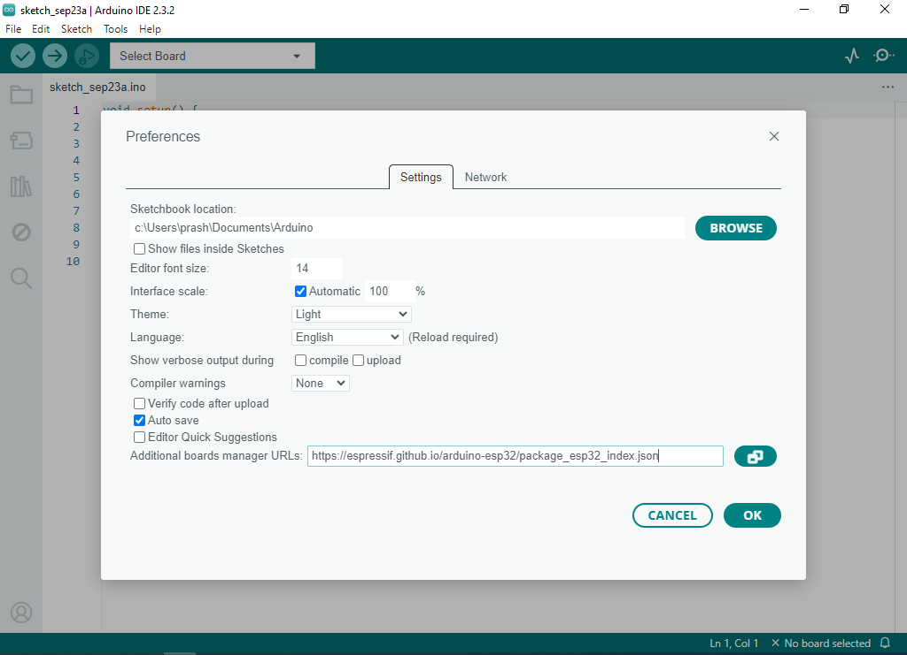
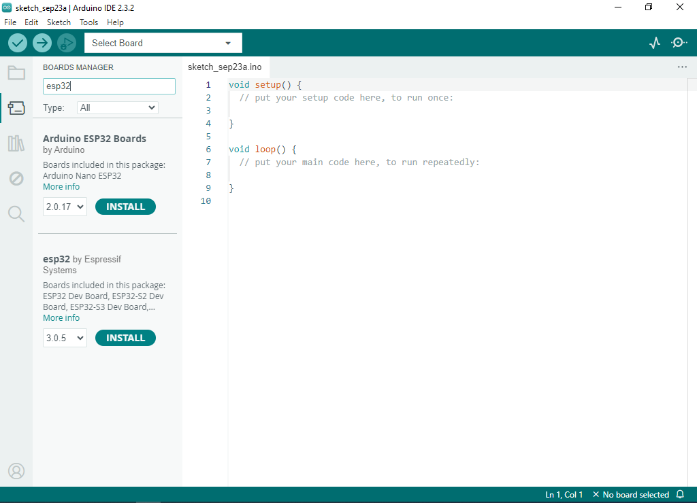
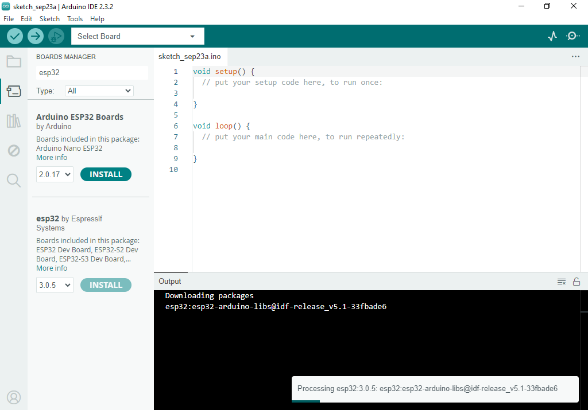

# Adding ESP32 Board Manager to Arduino IDE

Installing a board package is quick and easy, but let's take a look at what we need to do.

1. Open the **Arduino IDE 2**.

   

2. Go to **File -> Preferences**.  
   This will open the Preferences dialog box.  

   

3. Open your browser and go to [Installing - Arduino ESP32 latest documentation](https://docs.espressif.com/projects/arduino-esp32/en/latest/installing.html#installing-using-arduino-ide) and copy the Stable release link.  

   

4. Paste the link in the **Additional boards manager URLs** text box and click **OK**.  

   

5. Now, in the left column, click on the **Arduino board** icon. This will open a side window. Type `esp32` in the search field. We have to install the one named **esp32** by Espressif Systems, so just click the **INSTALL** button for that package.  

   

6. This will begin the installation process, which usually takes some time.  

   
